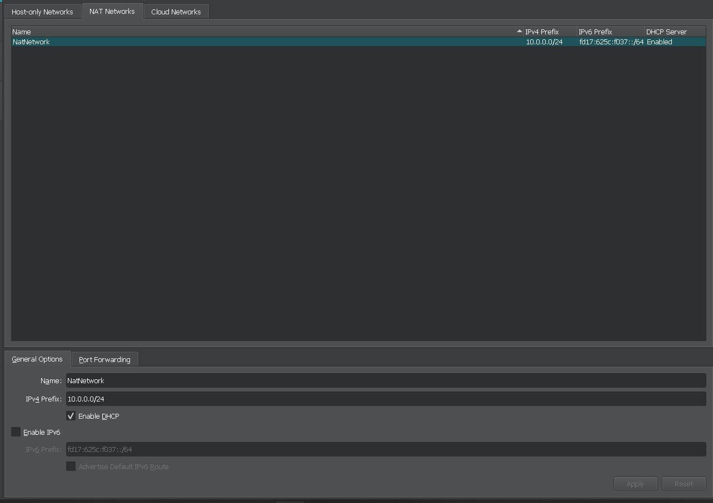
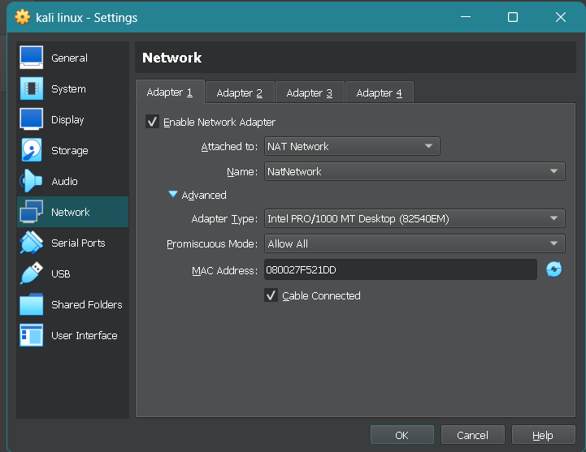
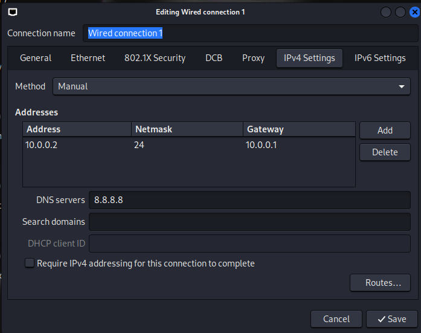

# 🔐 Cybersecurity Lab Environment Setup (WK1-PM1)

**Building an isolated virtual lab for penetration testing and ethical hacking practice**

---

## 📌 Project Overview

This project covers setting up a virtual cybersecurity testing lab using VirtualBox and Kali Linux, as part of the Networkwalks WK1-PM1 task.

The lab runs on an isolated NAT Network so that Kali Linux (the attacking machine) can reach the internet for updates and tools, while staying separated from the host's main network. Future target VMs (Windows, Android, etc.) can be added to the same network later.

---

## 🎯 Objectives

- Install VirtualBox (latest version) as the hypervisor.
- Import Kali Linux as the attacking/hacker VM.
- Create a custom NAT Network in the `10.0.0.0/24` subnet.
- Assign Kali Linux a static IP of `10.0.0.2/24`.
- Enable clipboard sharing, drag & drop, and a shared `/downloads` folder between host and VM.
- Verify full internet access from Kali Linux.
- Document issues encountered and how they were resolved.

---

## ⚙️ Lab Configuration

| Component          | Configuration        |
|---------------------|-----------------------|
| Hypervisor           | VirtualBox 7.2.16         |
| Attack OS            | Kali Linux 2023.3     |
| Virtual Network      | NAT Network (custom)  |
| Network Address      | 10.0.0.0/24            |
| Kali IP Address      | 10.0.0.2/24            |
| Default Gateway      | 10.0.0.1               |
| DNS Server           | 8.8.8.8                 |
| Shared Folder        | /downloads (host → VM) |

---

## 🪜 Setup Steps

1. Downloaded and installed 7-Zip and VirtualBox.
2. Created a custom NAT Network in VirtualBox (`File > Tools > Network > NAT Networks`) with IPv4 prefix `10.0.0.0/24` and DHCP enabled.
3. Imported the Kali Linux VM and attached its network adapter to the NAT Network.
4. Enabled clipboard sharing, drag & drop, and a shared folder pointing to the host's `/downloads` directory.
5. Set a manual IPv4 address on Kali (`10.0.0.2/24`, gateway `10.0.0.1`, DNS `8.8.8.8`).
6. Took a clean snapshot of the VM before further configuration.

### NAT Network Configuration


### Kali VM Network Adapter Settings


### Kali Manual IPv4 Settings


### Kali Running


---

## 🔎 Verification Commands

| Test | Command | Result |
|------|---------|--------|
| Check IP address | `ip a` | `eth0: <BROADCAST,MULTICAST,UP,LOWER_UP> mtu 1500 qdisc fq_codel state UP group default qlen 1000`<br>`    link/ether 08:00:27:f5:21:dd brd ff:ff:ff:ff:ff:ff`<br>`    inet 10.0.0.2/24 brd 10.0.0.255 scope global noprefixroute eth0`<br>`       valid_lft forever preferred_lft forever` |
| Test gateway | `ping 10.0.0.1` | `PING 10.0.0.1 (10.0.0.1) 56(84) bytes of data.`<br>`64 bytes from 10.0.0.1: icmp_seq=1 ttl=64 time=28.7 ms`<br>`64 bytes from 10.0.0.1: icmp_seq=2 ttl=64 time=3.99 ms`<br>`64 bytes from 10.0.0.1: icmp_seq=3 ttl=64 time=1.32 ms`<br>`--- 10.0.0.1 ping statistics ---`<br>`3 packets transmitted, 3 received, 0% packet loss, time 2176ms`<br>`rtt min/avg/max/mdev = 1.320/11.354/28.748/12.347 ms` |
| Test internet | `ping 8.8.8.8` | `PING 8.8.8.8 (8.8.8.8) 56(84) bytes of data.`<br>`64 bytes from 8.8.8.8: icmp_seq=1 ttl=115 time=32.1 ms`<br>`64 bytes from 8.8.8.8: icmp_seq=2 ttl=115 time=30.4 ms`<br>`64 bytes from 8.8.8.8: icmp_seq=3 ttl=115 time=29.8 ms`<br>`--- 8.8.8.8 ping statistics ---`<br>`3 packets transmitted, 3 received, 0% packet loss, time 2003ms` |
| Test DNS resolution | `ping google.com` | `PING google.com (142.251.221.110) 56(84) bytes of data.`<br>`64 bytes from cgk03s03-in-f14.1e100.net (142.251.221.110): icmp_seq=1 ttl=64 time=42.2 ms`<br>`64 bytes from cgk03s03-in-f14.1e100.net (142.251.221.110): icmp_seq=2 ttl=64 time=74.5 ms`<br>`64 bytes from cgk03s03-in-f14.1e100.net (142.251.221.110): icmp_seq=3 ttl=64 time=71.7 ms`<br>`--- google.com ping statistics ---`<br>`3 packets transmitted, 3 received, 0% packet loss, time 2007ms` |

---

## 🐞 Problems Encountered & Solutions

### Problem 1: No internet — "Destination Host Unreachable" even to the gateway

After setting the static IP, Kali could not reach even its own gateway (`10.0.0.1`), not just external addresses. This ruled out a simple DNS issue.

**Troubleshooting steps taken:**
1. Verified NAT Network settings (`10.0.0.0/24`, DHCP enabled) — correct.
2. Verified the Kali adapter was attached to the NAT Network — correct.
3. Ran the known VirtualBox 7 / newer Kali fix for the IPv4 Duplicate Address Detection (DAD) bug:
   ```
   sudo nmcli connection modify "Wired connection 1" ipv4.dad-timeout 0
   sudo nmcli connection down "Wired connection 1"
   sudo nmcli connection up "Wired connection 1"
   ```
4. Discovered a MAC address mismatch — `ip link show eth0` showed a different `link/ether` value than the `permaddr` VirtualBox had assigned, caused by NetworkManager's MAC randomization. Fixed by locking the connection to the permanent MAC:
   ```
   sudo nmcli connection modify "Wired connection 1" 802-3-ethernet.cloned-mac-address permanent
   sudo nmcli connection down "Wired connection 1"
   sudo nmcli connection up "Wired connection 1"
   ```
5. Continuing to isolate whether the remaining unreachable-gateway issue is caused by the host's firewall/VPN blocking VirtualBox's NAT engine, or requires recreating the NAT Network from scratch.

*(This issue is still being actively resolved — this README will be updated once the root cause is confirmed.)*

---

## 💡 What I Learned

- The difference between a standard NAT adapter and a NAT Network in VirtualBox, and why NAT Network is needed for multi-VM labs.
- How to configure static IPv4 addressing, gateway, and DNS on Kali Linux via `nmcli`.
- How MAC address randomization in NetworkManager can silently break VirtualBox's NAT engine, and how to diagnose it by comparing `link/ether` to `permaddr`.
- The importance of taking a clean snapshot before further configuration.

---

## 🔗 Tools & Resources

- 7-Zip: https://7-zip.org/download.html
- VirtualBox: https://virtualbox.org/wiki/Downloads
- Kali Linux: https://kali.org/get-kali

---

## 📌 Project Information

**Program:** Networkwalks Cybersecurity | **Week:** 01 | **Task:** WK1-PM1 — Lab Setup (VirtualBox & Kali Linux)
